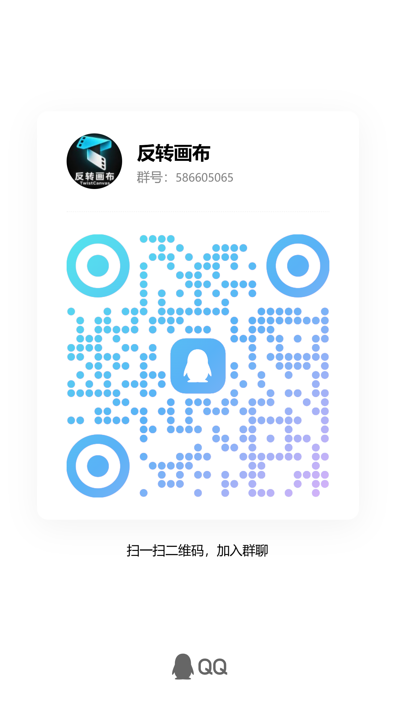

  

  <h1>反转画布 · TwistCanvas</h1>
  
<strong>让故事，从画布走向银幕。</strong>

  
面向 AI 漫剧创作的无限画布，把灵感、角色、分镜和影像放在同一个创作空间。

  

    <a href="https://twistai.cn"><strong>官网展示与体验</strong></a> ·
    <a href="https://twistapi.cn">API 站点导航</a> ·
    <a href="#快速开始">快速开始</a> ·
    <a href="#加入交流群">QQ 交流群</a> ·
    <a href="../../issues">反馈问题</a>
  

  
<strong>软件永久免费 · 自备模型API</strong>

---

## 它能帮你做什么

反转画布希望把 AI 漫剧创作中的多次切换，收进一张可以自由组织的画布：整理故事、建立角色与场景参考、推敲分镜，再连接你选择的模型服务生成素材。

| 创作空间 | 用途 |
| --- | --- |
| **无限画布** | 自由组织文字、图片、视频和节点连接，在同一空间梳理创作思路。 |
| **个人 API 渠道** | 配置自己的模型服务地址、API Key 和模型；按模型能力使用文字、图片、视频生成。 |
| **资产与创作记录** | 管理创作素材，查看任务状态，让参考、过程和结果更容易找到。 |
| **3D 导演台** | 辅助构图、角色布局和镜头预演，为分镜表达提供可视化参考。 |

### 正在完善的创作能力

- **Twist Agent**：围绕创意与画布协作。云端 Agent 的模型接入仍在完善，并非所有个人 API 都能直接用于云端 Agent。
- **视频重制**：导入原片、分析与确认分镜、设定角色或场景替换，再逐镜生成与合成。
- **视频转绘**：结合原视频与目标风格，交给支持视频输入的模型处理。
- **视频译制**：转写、校对译文、配音并合成新音轨。
- **视频超分**：已提供素材与参数草稿入口，执行工作流尚待接入，目前不会输出超分成片。

视频重制、转绘、译制的页面与流程已接入，实际执行仍依赖对应模型、转写、配音等服务配置。视频工作室目前仍需服务端模型接入，尚未完成全部个人 API 直连能力；页面入口不代表已能运行所有流程。SAM 动作提取、Blender 调整等需要外部工具配合。

## 快速开始

**[twistai.cn](https://twistai.cn/) 主要用于产品展示与在线体验。长期创作推荐在自己的电脑上使用，便于管理素材、配置个人 API 和保存项目。**

计划提供 Windows 本地安装包，**目前尚未发布**；本仓库的 “Code → Download ZIP” 仅下载介绍资料，不能安装软件。正式下载地址将在安装包验证完成后公布。

当前可以在线体验：

1. 打开 **[twistai.cn](https://twistai.cn)**，注册并登录。
2. 在 **设置 → 个人渠道** 中，填写自己的服务地址、API Key 和模型。
3. 新建画布，添加文字、图片或视频节点，选择与你的服务兼容的模型开始创作。
4. 遇到问题，可以加入 QQ 群交流，或在本仓库提交 Issue。

请妥善保存 API Key，不要放进 Issue、聊天截图或公开链接。模型请求可能经网站后端转发给你配置的服务商；请使用适当限额的密钥和可信服务地址。

## 免费使用说明

**反转画布软件永久免费。** 用户无需购买平台积分或充值平台余额。

图片、视频、文本等 AI 模型由用户自行配置 API。**第三方模型的调用费用及额度由相应服务商决定，用户自行承担**，平台免费不代表第三方模型调用免费，也不承诺无限服务器资源。

## API 导航与推荐

**[Twist API · twistapi.cn](https://twistapi.cn/)** 是我们的 API 站点导航，方便查找与比较第三方模型服务，目前不提供统一 API 接口或统一账户余额。

- [88API](https://88api.ai/sign-up?aff=Pova)：作者正在使用的 API 中转服务，可前往了解模型、价格与接入方式。
- [RunningHub](https://www.runninghub.cn?inviteCode=lxmcwrta)：云端运行 AI 图片与视频工作流。**新用户注册时，请填写作者的邀请码：`lxmcwrta`。**

上面的 88API 和 RunningHub 链接是**推广链接**。通过链接注册或使用，作者可能获得推广收益，用于支持项目持续维护。是否使用由你自行决定，价格、额度与服务以对方页面为准；无需通过推广链接才能使用反转画布。

## 加入交流群

**QQ群：586605065**

群名称：**反转画布**

欢迎交流 AI 漫剧流程、分享使用体验和提出功能建议。可以在 QQ 中搜索群号，或扫描下方二维码加入。

  
  
二维码无法识别或失效时，请在 QQ 中搜索群号 <strong>586605065</strong>。

## 问题反馈

提交 Issue 时，请说明所在页面、操作步骤、预期结果与实际现象。截图前隐藏邮箱、API Key、密码和未公开素材。

本仓库用于公开产品介绍、使用说明与问题反馈；后续也会发布可下载的安装包。**TwistCanvas 应用源码不在本仓库发布**，安装包发布前可以通过官网体验。

## 关于本仓库与开源组件

免费使用与公开源码是两件不同的事。这个仓库是产品展示与交流入口，不是应用源码仓库。

TwistCanvas 在开源项目 [Open AI Canvas](https://github.com/ddcat-ai/open-ai-canvas) 的基础上开发，并使用其他第三方组件。上游项目及各组件仍遵循各自原有许可证，相关作者的权利与署名不会因本产品源码不公开而改变。

---

  <strong>反转画布 · TwistCanvas</strong> 
  <a href="https://twistai.cn">官网展示与体验</a> · <a href="https://twistapi.cn">API 站点导航</a>

